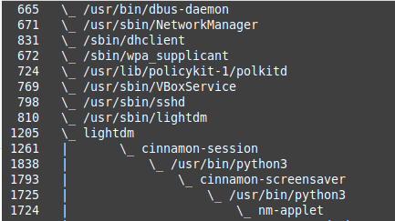

# pst

pst is a command-line utility that creates visual trees of your running processes on Unix-like systems. 

pst is a reproduction of [pstree](https://en.wikipedia.org/wiki/Pstree), written in Python.

----

### Motivation

Purely for the fun of it! Feel free to fork and add features.

----

### Installation

pst currently supports Python 2.x-3.x.

#### PyPI

    $ sudo pip install pst

#### Manual

First clone the pst repository and go into the directory.

    $ git clone git://github.com/mixedconnections/pst.git
    $ cd pst

Then run the command below.

    $ sudo python setup.py install

If you don't have root permission (or don't want to install pst with sudo), try:

    $ python setup.py install --prefix=~/.local
    $ export PATH=~/.local/bin:$PATH

### Usage

    shell> 
    shell> pst
    shell> pst --help
    shell> pst -o trees.txt

